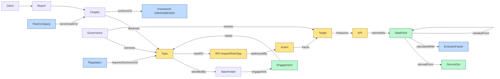

# gbrain → susr 對應映射報告

**研究日期**：2026-05-25
**研究範圍**：gbrain 公開 repo + 官方 docs（README、AGENTS、CLAUDE、V0、Recommended Schema、Topologies）+ 必要外部評論（penfieldlabs 批判性視角）
**目的**：作為 susr 採 gbrain-style local-first + MCP 架構的設計起點，明確「該抄什麼／該改造什麼／該自建什麼」。
**研究者**：susr 架構研究 sub-agent
**對應戰略決策**：2026-05-25 決定採 gbrain-style local-first + MCP 路線，不先做 web SaaS。

---

## 1. gbrain 核心摘要

**一句話定位**：gbrain 是 Garry Tan（YC President/CEO）開源的「AI agent 的腦」——把一個 git repo 的 markdown 檔案當成 system of record，同步進 Postgres + pgvector，對外以 MCP 暴露 30+ 個 tool，讓 Claude Code / Cursor / Claude Desktop 等 agent 能用「search」與「think」兩種模式查詢、合成、寫入。

**核心資料模型**：
- **儲存層雙引擎**：PGLite（Postgres 17 WASM，~50K pages 以下零維運）／ Postgres + pgvector（團隊或大規模），透過 `BrainEngine` interface 抽象 ~47 個操作。
- **9 張核心表**：`pages`（含 `compiled_truth`、`search_vector`）、`content_chunks`（1536 維 embedding）、`timeline_entries`（append-only 證據鏈）、`links`（typed edges：`works_at` / `invested_in` / `attended` / `mentions` …）、`tags`、`page_versions`、加上 entity registry / job queue 周邊。
- **兩軸組織**：`Brain`（資料庫實例，可掛多顆）× `Source`（同一 brain 內的多個 repo 命名空間）。

**Ingestion 流程**：
```
Import → Chunk（semantic / recursive） → Embed（OpenAI text-embedding-3-large 1536 維）
   → Postgres（pages / chunks / timeline / links / tags）
Query → Multi-query expansion（Claude Haiku） → 平行 vector + keyword 搜尋
   → RRF fusion（score = sum(1/(60+rank))） → 4-layer dedup → stale alert → 帶引用的結果
```

**Knowledge graph 抽取機制**（zero LLM？）：官方文件宣稱「self-wiring graph，without LLM calls」。實際拆解後，所謂 zero-LLM 來自四個資料庫原語：(1) 帶 aliases 的 entity registry，(2) 不可變 event ledger（timeline），(3) 帶 provenance 的 fact store，(4) typed edges relationship graph。pages 的 frontmatter（`role` / `company` / `relationship`）與 markdown 內 `[[slug]]` 形式的交互引用，會被 ingest pipeline 結構化解析為 edges。**但要注意**：外部評論（penfieldlabs）查證後指出「compiled-truth rewriting、dream cycle、entity detection」目前只存在於 markdown 指令裡，原始碼沒有對應實作——換句話說，「自動抽 entity」這件事在 v0 大多仍仰賴 agent 在對話中執行 markdown 指令，而非 pipeline 自動執行。**susr 不能把這個假設當成現成功能，要自己補。**

**MCP tools 暴露**（從 AGENTS.md / CLAUDE.md 抓出的關鍵清單，~47 個 shared operations）：
- 檢索類：`search`、`query`、`find_trajectory`、`find_contradictions`、`find_experts`、`find_anomalies`、`get_recent_salience`
- 合成類：`think`（retrieval + 帶引用的合成，可選擇注入 trajectory）
- 寫入類：`put_page`（write-scoped，subagent 受 `allowedSlugPrefixes` allowlist 約束）
- 圖遍歷：`traverseGraph`、`traversePaths`（接受 `sourceId` / `sourceIds`，呼應 scope）
- 作業類：`submit_job`（BullMQ-shaped Minions queue，protected-name guard 防 shell RCE）
- 診斷類：`gbrain doctor`、migration / upgrade

**Synthesis layer 兩種模式**：
- `gbrain search`：純混合檢索（vector + BM25 + RRF + reranker），快、無 LLM 成本，回 top pages。
- `gbrain think`：檢索後做合成，輸出「composed answer with explicit citations to source pages AND honest note on what the brain doesn't know yet」。

**性能/規模數據（官方）**：
- 作者本人佈署：146,646 pages、24,585 people、5,339 companies、66 個 cron jobs。
- 240-page corpus benchmark：P@5 49.1% / R@5 97.9%；graph 啟用 vs 關閉，P@5 +31.4 個百分點。
- 安裝：PGLite 模式下 30 分鐘到可用，DB 2 秒就緒。
- 成本：7,471 pages 約 750MB 儲存，首次 embedding ~$4–5。

---

## 2. gbrain 的可複用設計（What to copy）

| # | 設計決策 | 為什麼對 susr 重要 |
|---|---------|------------------|
| 1 | **Markdown + frontmatter 作為 system of record，DB 只是索引** | susr 顧問每個 client 的「scoping decision、materiality matrix、IRO、KPI」本來就會以 markdown 草稿存在；保留 git diff / blame / PR review，符合 ESG 報告「可追溯（auditable）」原則。 |
| 2 | **`compiled_truth` 在橫線之上，`timeline` 在橫線之下（append-only 證據鏈）** | 完美對應 ESG「結論 + 證據」的揭露邏輯。每個 KPI 都需要「值、邊界、來源、計算公式」；timeline 就是 restatement 軌跡的天然容器（> 5% 變動需揭露 → 在 timeline 多一行）。 |
| 3 | **Two-engine（PGLite 本地零維運 / Postgres 團隊共享）** | 顧問本機跑 PGLite，後期顧問公司想要團隊知識庫升級 Postgres——無需重寫資料層。剛好對應 susr「先個人 → 後團隊」路線。 |
| 4 | **MCP 暴露 + scope-gated（read/write/admin）** | 顧問用 Claude Code 就能對話操作；OAuth scope 與 `allowedSlugPrefixes` 為未來「實習生只能寫 draft、合夥人才能 sign-off」鋪路。 |
| 5 | **Search vs Think 兩段式** | 顧問日常 80% 是查（「我去年怎麼寫類似客戶的 TCFD？」），20% 才是合成（「幫我擬一段針對 XX 客戶 E1 的章節初稿」）。分開設計可以省 token、提速。 |
| 6 | **`BrainEngine` interface 抽象** | susr 若未來要換 backend（Supabase / DuckDB / SQLite + sqlite-vec）或加入 RLS，不會動到 domain layer。 |
| 7 | **Skill = 「fat markdown files」，跟 CLI/MCP 解耦** | susr 既有的 8-Phase SKILL.md 哲學一致；直接沿用 Anthropic Skills 機制即可，不必發明新框架。 |
| 8 | **`OperationContext.remote` 信任邊界** | susr 有「顧問本機（trusted）vs 客戶端來的 webhook / 上傳（untrusted）」的天然區分，這個原語可以直接搬。 |
| 9 | **`page_versions` snapshot + restatement** | 永續報告書年度版本管理、ESG 數據基線重述（restatement > 5% 揭露）剛好對應。 |
| 10 | **「pre-computed synthesis, not re-derived RAG」哲學** | 顧問的價值在「重複可賣」——把今年 review 的洞見編譯成 compiled_truth，明年同產業客戶可直接 retrieval，不必每次重跑 LLM 合成。 |

---

## 3. gbrain 的不適用點（What NOT to copy / 需改造）

| 領域 | gbrain 現況 | susr 需要的擴充 |
|------|-----------|---------------|
| **多框架對應** | 無；schema 是「人 / 公司 / 交易」單軸 | 需要 GRI 2021 / ISSB S1+S2 / ESRS / 台灣金管會 / SASB 行業準則的 **datapoint 映射層**，且每個對應有「版本 × 適用年度 × 是否強制」三維屬性 |
| **雙重重大性（Double Materiality）** | 無 | 需要 `Topic` entity 攜帶 `impact_score` 與 `financial_score` **雙軸**，且兩軸各自要拆「嚴重度 × 範圍 × 不可逆性 × 可能性」與「規模 × 時間 × 機率」 |
| **利害關係人議合（Engagement）** | gbrain 把 person 當靜態 entity | susr 需要 `Stakeholder × Topic × Engagement(time, method, sample size)` 的**三維事件**，這是 gbrain timeline 不夠用的地方 |
| **時效性資料** | gbrain 沒有「版本／生效日／失效日」原語 | 排放因子（環境部 / IEA / DEFRA / ecoinvent 每年更新）、法規版本（金管會 2026 vs 2028 ISSB 三階段）、SBTi 路徑——都必須有 `effective_from` / `effective_to` / `superseded_by`，且 retrieval 時要過濾 |
| **多客戶隔離** | 官方明說 v0 「single-user, local-only」，「multi-tenant 不在範圍」 | 顧問 = 同時服務 N 家客戶，必須**第一天就把 client 當頭等公民**（見 §6） |
| **可確信性（Assurance Readiness）** | 無 | 每個 datapoint 必須能追溯到「來源檔案 + 公式 + 計算邊界 + 責任人 + 確信狀態」；gbrain 的 `timeline_entries` 結構是好起點，但欄位要擴 |
| **反綠色洗白檢查** | 無 | susr SKILL.md 有 5 項強制檢查（未達標揭露、目標含基線 / 時程 / 驗證、Scope 3 廣度、董事 ESG 背景、負面事件透明）——需要做成 schema 層 invariant，retrieval 時主動回灌 |
| **連結性（Connectivity）強制** | gbrain edges 是「事實型」（A works_at B） | susr 需要「規範型」edges：`Action --addresses--> IRO`、`Target --tracks--> KPI`、`Chapter --discloses--> Topic`，**斷鏈時要 fail-closed**（少了 IRO 對應就不能 sign-off 章節） |
| **章節骨架的標準化** | gbrain page template 是 person / company / meeting | susr 需要 `Chapter` 強制含 `IRO → Governance → Strategy → Action → Target → KPI → Outlook` 七段，缺一段觸發 lint |
| **PII / 個資保護** | gbrain 是「個人腦」，無隔離壓力 | susr 處理客戶的員工薪酬、勞檢、客訴等敏感資料，跨 client 共享前要強制去識別化 |

---

## 4. susr ESG entity 圖（核心交付物）

### 4.1 typed entities 一覽

| Entity | 基本欄位 | 典型 frontmatter |
|--------|---------|-----------------|
| **Client**（客戶） | `slug`, `legal_name`, `stock_code`, `industry_gri_sector`, `boundary` (合併/營運控制/股權法), `reporting_period`, `applicable_standards[]` | `tier: A/B/C`, `lead_consultant`, `assurance_provider` |
| **Report**（報告書） | `slug`, `client_slug`, `year`, `version`, `language`, `framework_bundle`, `status` (draft/review/filed) | `published_at`, `mops_filing_no`, `assurance_level`（無/有限/合理） |
| **Chapter**（章節） | `slug`, `report_slug`, `title`, `framework_refs[]`, `owner`, `compiled_truth`, `timeline[]` | `discloses_topics[]`, `mandatory: true/false` |
| **Topic**（重大議題） | `slug` (E1/S6/G2…), `name`, `axis` (E/S/G), `impact_score`, `financial_score`, `materiality_tier` (核心/重大/邊界), `industry_specificity` | `assessed_at`, `assessed_by`, `assessment_year` |
| **IRO**（衝擊/風險/機會） | `slug`, `topic_slug`, `type` (Impact/Risk/Opportunity), `category` (物理/轉型/聲譽…), `time_horizon` (S/M/L), `financial_magnitude` | `evidence_refs[]` |
| **Stakeholder**（利害關係人） | `slug`, `category` (員工/客戶/投資人/供應商/社區/政府/媒體NGO), `influence_on_company`, `affected_by_company` | `engagement_channels[]` |
| **Engagement**（議合事件） | `slug`, `stakeholder_slug`, `topic_slugs[]`, `date`, `method` (問卷/訪談/焦點/說明會), `sample_size`, `findings_summary` | `evidence_refs[]` (議合紀錄 PDF) |
| **Governance**（治理機制） | `slug`, `body` (董事會/永續委員會/管理階層), `oversight_topics[]`, `meeting_frequency`, `kpi_linkage` | `members_esg_expertise[]` |
| **Action**（行動方案） | `slug`, `chapter_slug`, `iro_addressed[]`, `budget`, `progress_pct`, `owner_department`, `period` | `evidence_refs[]` |
| **Target**（目標） | `slug`, `kpi_slug`, `baseline_year`, `baseline_value`, `target_value`, `target_year`, `verification_path` | `sbti_alignment: 1.5C/2C/N`, `is_quantitative: bool` |
| **KPI**（指標） | `slug`, `topic_slug`, `name`, `unit`, `framework_refs[]` (GRI 305-1, ISSB S2 §29…), `boundary`, `formula` | `values_by_year[]`, `restatement_flag` |
| **DataPoint**（單筆數據） | `slug`, `kpi_slug`, `year`, `value`, `source_refs[]`, `calculation_method`, `assurance_status` (none/limited/reasonable), `last_assessed`, `responsible_person` | `restated_from: <slug>`, `confidence: high/med/low` |
| **Regulation**（法規） | `slug`, `jurisdiction`, `authority`, `version`, `effective_from`, `effective_to`, `applies_to_industries[]` | `superseded_by: <slug>` |
| **EmissionFactor**（排放因子） | `slug`, `category` (Scope1燃料/Scope2電力/Scope3類別), `region`, `source` (環境部/IEA/DEFRA/ecoinvent), `version`, `value`, `unit`, `effective_from` | `superseded_by: <slug>` |
| **Framework**（標準/框架） | `slug` (GRI / ISSB-S2 / ESRS-E1 / TCFD…), `version`, `disclosures[]`, `is_mandatory_in[]` (TW/EU…) | — |
| **PeerCompany**（同業） | `slug`, `industry`, `country`, `latest_report_year`, `notable_practices[]` | `report_pdf_ref` |
| **SourceDoc**（原始文件） | `slug`, `client_slug`, `doc_type` (ERP匯出/問卷/供應商回覆/舊報告/帳單), `period`, `file_hash`, `ingest_date` | `pii_classification` |

### 4.2 典型 typed edges

```
Client --has--> Report
Report --contains--> Chapter
Chapter --discloses--> Topic
Topic --identifiedBy--> Stakeholder      # 來自議合
Topic --hasIRO--> IRO                     # 每個 Topic 至少 1 個 I/R/O
IRO --addressedBy--> Action               # 連結性必過
Action --tracks--> Target
Target --measures--> KPI
KPI --reportedAs--> DataPoint             # 每年一筆
DataPoint --derivedFrom--> SourceDoc      # 可追溯
DataPoint --calculatedWith--> EmissionFactor  # GHG 用
Governance --oversees--> Topic
Governance --reviews--> Target
Chapter --conformsTo--> Framework         # 多框架對應
Regulation --requiresDisclosureOf--> Topic
Stakeholder --engagedVia--> Engagement
Engagement --raised--> Topic
PeerCompany --benchmarkFor--> Chapter
DataPoint --restatedFrom--> DataPoint     # 跨年重述
Report --supersedes--> Report             # 年度版本
```

### 4.3 Mermaid 關係圖（核心連結性閉環）



**連結性 invariant（susr 應在 schema 層 fail-closed 強制）**：
1. 任一 `Topic.materiality_tier == 核心` 必須至少有 1 個 `Action` 經由 `IRO → addressedBy` 鏈到它。
2. 任一 `Chapter` 必須 `conformsTo` ≥ 1 個 `Framework`，且 `discloses` ≥ 1 個 `Topic`。
3. 任一 `Target` 必須有 `baseline_year`、`baseline_value`、`target_year`、`verification_path` 四欄位齊全（反綠色洗白）。
4. 任一 `DataPoint`（量化 KPI 類）必須有 ≥ 1 個 `SourceDoc` 經 `derivedFrom` 連入。
5. 排放類 `DataPoint` 必須 `calculatedWith` 一個 `effective_from ≤ reporting_year ≤ effective_to` 的 `EmissionFactor`。

---

## 5. SOP 8-Phase → gbrain capability 對照

| Phase | 主要 gbrain primitives | 缺什麼（susr 要補） |
|-------|---------------------|------------------|
| **1 Scoping** | `Client` page + `Report` page；frontmatter 帶 `applicable_standards[]`、`boundary`；search 取「同產業 peer 的 scoping 決策」 | Scoping 決策樹（GRI Sector Standard 對照、合併報表 vs 營運控制決策） |
| **2 Research / Benchmark** | `PeerCompany` + `Regulation` + `EmissionFactor` ingest；MCP 工具呼叫 WebSearch；put_page 寫入 `research-log.md`；timeline 留來源 | 法規時程比對器（金管會 2026 / 2027 / 2028 三階段強制日對到客戶適用年） |
| **3 Materiality** | `Topic` + `IRO` + `Stakeholder` + `Engagement` entities；`think` 合成議題池；put_page 寫 materiality matrix | 雙軸評分 invariant；議題池 prior（28 項旅館業特化等 industry pack）；矩陣視覺化（gbrain server-side SVG 可借） |
| **4 Data Collection** | `KPI` + `DataPoint` + `SourceDoc` + `EmissionFactor`；put_page 為每個 KPI 建頁；timeline 為證據鏈；submit_job 做 xlsx skill 呼叫 | GHG 計算引擎（Scope 1/2/3 公式）；restatement 跨年比較器；xlsx skill 整合 |
| **5 Drafting** | `Chapter` page（compiled_truth = 章節主文，timeline = 草稿迭代史）；`think` 帶 `discloses_topics` filter 合成初稿；7 段骨架 lint | 反綠色洗白檢查器；連結性閉環檢查（IRO→Action→Target→KPI 斷鏈警告） |
| **6 Assembly** | `submit_job` 呼叫 docx / pdf / pptx skill；page_versions snapshot；Brand 套用 | document-skills 整合協定；iXBRL 標記預留欄；多語版本 |
| **7 Gap Analysis** | `find_contradictions` + `find_anomalies` + 自訂 `find_missing_disclosures`；put_page 寫 `gap-analysis.md` | GRI Content Index 自動生成；ESRS datapoint mapping；確信前置清單 |
| **8 Filing & Improve** | `page_versions` 鎖版；submit_job 觸發 MOPS 上傳 helper；post-mortem 寫入 client brain 供下年用 | MOPS / TWSE 公告時程提醒；下年度 backlog auto-handoff |

---

## 6. 多 client 隔離設計（呼應 Q4 討論）

gbrain v0 官方明說「single-user, local-only, multi-tenant 不在範圍」，但 v0.19+ 提供了 `gbrain mounts add` 與 v0.34+ 的 source-level OAuth scope，提供了三種顧問可選的隔離模型：

### 方案 A：Per-client git repo + Per-client PGLite brain

```
~/susr/
  clients/
    lealea-5364/
      .git/
      .gbrain/  (PGLite database file)
      scoping/, materiality/, data/, chapters/, reports/
    acme-1234/
      .git/
      .gbrain/
      ...
```

切換 client 用 `cd` + `GBRAIN_HOME` 環境變數（或 `.gbrain-mount` dotfile）。
- **優點**：物理隔離最強；client 結案可整包打包交付；git history 乾淨；無 cross-client 洩漏風險；符合個資法「目的範圍內」原則。
- **缺點**：跨 client 學習被切斷（「我去年怎麼寫紡織業？」要手動切庫）；顧問常用知識（產業 prior、排放因子、法規版本）每個 client repo 都得有一份或 symlink。
- **適合**：susr 早期（顧問同時手上 < 10 家 client）。

### 方案 B：單 repo / 多 folder + Postgres tenant_id（含 RLS）

```
~/susr-workspace/  (單一 git repo)
  shared/              ← 共用：emission_factors/, regulations/, peer_universe/, industry_packs/
  clients/
    lealea-5364/
    acme-1234/
```

對應一個 Postgres database，所有 pages 表都加 `tenant_id` 欄位，啟用 Postgres RLS（Row Level Security），由 `OperationContext` 注入。
- **優點**：共用知識庫（emission factor、法規）只有一份；可做跨 client query（「哪些 client 還沒做 SBTi？」）；升級到團隊版時是同一條路徑。
- **缺點**：RLS 設錯就洩漏（gbrain 文件明說「a wrong alias writes/queries the wrong brain silently」）；client 結案交付需 export filter；個資法 / NDA 風險較高。
- **適合**：susr 中期（顧問公司 5–20 人團隊，client > 20）。

### 方案 C：Per-client Postgres schema

單一 Postgres instance、共用 `shared` schema、每個 client 一個獨立 schema（`client_lealea_5364`）。
- **優點**：介於 A 與 B 之間；schema 級隔離比 RLS 安全很多；資料庫層 backup/restore 以 client 為單位。
- **缺點**：schema 數量爆炸時 migration 痛苦；ORM 支援不一；PGLite 不支援多 schema 的成熟度待驗。
- **適合**：susr 成熟期（顧問公司 50+ client、多區域團隊）。

**建議**：susr v0.1 採方案 A（直接搬 gbrain 預設）；在資料模型設計時保留 `tenant_id` 欄位作為未來方案 B/C 的退路。**`shared/` 知識庫（emission factors、regulations、industry packs）一開始就分離，用 git submodule 或 npm package 同步到每個 client repo**——這是 susr 不同於 gbrain 的關鍵：顧問的「腦」由「客戶私有 + 顧問公司共用」兩半組成。

---

## 7. 下一步建議

**推薦方案 C：不 fork 但 import gbrain 為依賴，susr 專注 ESG domain layer。**

理由：
1. **gbrain 的腦部分（pgvector / hybrid search / RRF / MCP server）是工程基礎建設**，不是 susr 的差異化價值；fork 維護成本高，且 gbrain 仍在快速迭代（v0.19 → v0.34 短期內多次破壞性更新）。
2. **susr 的價值在 ESG domain schema（§4 那張圖）+ 8-Phase SOP + 連結性 invariant**，這些是 gbrain 完全沒有的。
3. 外部評論（penfieldlabs）已警告：gbrain 的「compiled-truth rewriting / dream cycle / entity detection」目前只在 markdown 指令裡、沒實作。**若 fork，這些坑也一起繼承**；不如把 gbrain 當「儲存層 + 檢索層」，susr 自己決定 entity 抽取與合成節奏。
4. 採 import 路徑，susr 仍可享受 gbrain 的 MCP server、Skill 框架、CLI、page_versions 等基礎建設；同時保留「換 backend」的自由（萬一 gbrain 走偏，可改用 LangChain / Mastra / 自建）。

**具體執行**：
- **第 1 步**：把 gbrain 用 `npm install` 或 git submodule 接進來；建一個 `susr-brain` 的 wrapper，覆寫 `BrainEngine` 的部分方法以支援 §4 的 typed entities 與 §4.3 的 invariant。
- **第 2 步**：從 Phase 3（重大性評估）開始試做 ESG-specific 流程——這是 susr 跟 gbrain 差距最大、價值密度最高的地方。**沿用力麗 5364 已有的 example 當 test fixture。**
- **第 3 步**：把現有 `references/*.md`（議題池、GHG、台灣指引、glossary）轉成 `shared/` 知識庫的 markdown pages，可被任何 client brain mount。

---

## 8. 風險與未解問題

1. **gbrain 的「zero-LLM entity extraction」實際上多大程度自動？** 文件強調 ingest pipeline 自動 wire，但原始碼層面（依 penfieldlabs 查證）關鍵詞 `rewrite/stale/synthesize/cron/schedule` 都不存在。需要實際 `git clone` 看 `src/ingestion/` 才能下定論。**未驗證前不要對 susr 使用者承諾「自動抽 entity」。**
2. **PGLite 對 ESG 報告書規模夠不夠？** 力麗 5364 試做估算約 200–500 pages / client。10 個 client = 2K–5K pages，遠低於 gbrain 50K 上限——但每個 DataPoint 帶完整 timeline + version 後體積會膨脹，需要試做後測量。
3. **gbrain 的 graph traversal API 是否足夠表達 susr 連結性 invariant？** §4.3 列的 5 條 invariant 屬於「結構約束」（schema-level），可能需要在 susr layer 自己跑 lint，而非倚賴 gbrain `traverseGraph`。
4. **embedding 模型對中文 ESG 術語的表現？** OpenAI text-embedding-3-large 在中英混雜的 ESG 術語（如「雙重重大性」「IRO」「Scope 3 類別 11」）的 retrieval 品質未測；可能需要評估 Voyage / BGE-M3 / Cohere 等替代方案。
5. **多 client 隔離方案 A 的「共用知識庫同步」實作細節**：git submodule vs npm vs 純 file copy 各有痛點，需要原型驗證。
6. **iXBRL / ESEF 標記**：金管會 2028 強制 ISSB 後可能要求結構化標記，gbrain 完全沒這塊；要評估是否在 §4 schema 階段就把 `xbrl_concept` 欄位預留。
7. **個資 / 商業機密處理**：當顧問把客戶員工薪酬、勞檢紀錄 ingest 進 PGLite，embedding 會送 OpenAI——這是合約風險。需設計「本地 embedding（如 BGE / Ollama）+ 雲端 embedding」的二段式 pipeline。
8. **gbrain 缺 web UI、susr 顧問是否能接受純 CLI/Claude Code？** 目標用戶（ESG 顧問）多非 dev 背景；可能需要 susr 自己出一個 lightweight 桌面 UI（Tauri？）包 gbrain，作為非工程顧問的入口。

---

## Appendix A：原始 gbrain 資源連結與摘要

| # | 連結 | 文件性質 | 重要程度 | 本報告引用段落 |
|---|------|---------|---------|--------------|
| 1 | `https://github.com/garrytan/gbrain` | repo 入口；含資料夾結構、語言佔比、benchmark 概述 | ★★★★ | §1（性能/規模）、§2（two-engine）、§5 |
| 2 | `https://raw.githubusercontent.com/garrytan/gbrain/master/README.md` | 對外定位、scale claim、MCP 客戶端清單、安裝路徑 | ★★★★★ | §1 全段；§2#3,#4 |
| 3 | `https://raw.githubusercontent.com/garrytan/gbrain/master/docs/GBRAIN_V0.md` | V0 設計哲學、9 表 schema、ingest/retrieval pipeline、trade-offs（含「multi-tenant 不在 v0」明示） | ★★★★★ | §1（ingest 流程、9 表）、§2#1,#2,#9,#10、§3（多 client 缺口）、§6（PGLite 上限） |
| 4 | `https://raw.githubusercontent.com/garrytan/gbrain/master/docs/GBRAIN_RECOMMENDED_SCHEMA.md` | 19 個 entity directory、frontmatter 範本、page template（person/company/meeting）、self-wiring 機制描述 | ★★★★★ | §1（self-wiring 4 原語）、§2#1,#2,#5、§4 對照啟發 |
| 5 | `https://raw.githubusercontent.com/garrytan/gbrain/master/AGENTS.md` | MCP tool 清單（47 ops 部分列舉）、`OperationContext.remote` 信任邊界、source-level scope（v0.34+）、brain mounts（v0.19+） | ★★★★★ | §1（MCP tools）、§2#4,#8、§6（mounts add、source scope） |
| 6 | `https://raw.githubusercontent.com/garrytan/gbrain/master/CLAUDE.md` | Claude agent 對 gbrain 的操作指南、Brain × Source 兩軸、`allowedSlugPrefixes` allowlist | ★★★★ | §1（兩軸組織）、§2#4、§5（put_page allowlist） |
| 7 | `https://raw.githubusercontent.com/garrytan/gbrain/master/DESIGN.md` | 設計系統 token（colour / spacing / voice），**不含**架構 | ★ | 確認此檔不含架構資訊；提醒未來找架構要看 V0 與 architecture/ 子資料夾 |
| 8 | `https://raw.githubusercontent.com/garrytan/gbrain/master/docs/architecture/topologies.md` | 三種佈署 topology：personal-local / cross-machine thin client / split-engine multi-tenant per worktree | ★★★★ | §6 全段 |
| 9 | `https://raw.githubusercontent.com/garrytan/gbrain/master/docs/mcp/README.md` | **HTTP 404，文件不存在**；MCP per-client 設定要從 `docs/mcp/<client>.md` 個別查 | — | 未引用 |
| 10 | `https://dev.to/penfieldlabs/the-yc-president-endorsed-an-ai-memory-system-with-fake-benchmarks-then-he-shipped-his-own-we-4c9l` | 外部批判：MemPalace benchmark 灌水、gbrain 多個旗艦功能僅存在於 markdown 指令未實作、MCP server 12 個關鍵 bug | ★★★ | §1（zero-LLM 注意事項）、§7（fork 風險）、§8#1 |

**標記說明**：★ 數越多代表對本報告結論的支撐越關鍵。所有 gbrain 引用都以官方 master 分支為準（研究日 2026-05-25 snapshot），未做版本鎖定；正式採用前建議再做一次 freshness check。
